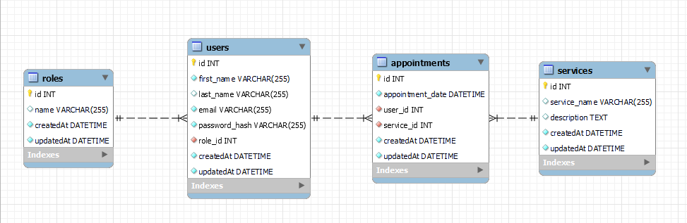

# REST API: TATTOO STUDIO (backend project)


## Table of Contents :file_folder:

1. [Description](#description) :classical_building:
2. [Stack](#stack) :gear:
3. [Features](#features)
<!-- 4. [Endpoints](#enpoints) -->
4. [DataBase](#database) :open_book:
5. [Installation](#installation)
6. [Implementation](#implementation)
7. [Link](#link) :dart:
8. [Developer](#developer) :wave:

## 1. <a id="description">Description</a>

The project consists of developing a REST API for managing appointments in a tattoo studio. The API will allow users to perform operations such as creating, listing, updating and deleting services, managing users and appointments.

## 2. <a id="stack">Stack</a>

- ORM: 
- Language: 
- Framework: 

## 3. <a id="features">Features</a>

- User Registration and Login
- User Management
- Service Management
- Appointment Management

## 4. <a id="enpoints">Endpoints</a>

### Authentication

| Method | URI                  | Action            |
| ------ | -------------------- | ----------------- |
| POST   | `/api/auth/register` | User Registration |
| POST   | `/api/auth/login`    | User login        |

### Users

| Method | URI                                    | Action                     | Rol         |
| ------ | -------------------------------------- | -------------------------- | ----------- |
| GET    | `/api/users`                           | View all users             | Super Admin |
| GET    | `/api/users/profile`                   | View user profile          |             |
| PUT    | `/api/users/profile`                   | Modify profile information |             |
| GET    | `/api/users?email=example@example.com` | Filter user by email       | Super Admin |
| DELETE | `/api/users/:id`                       | Delete user                | Super Admin |
| PUT    | `/api/users/:id/role`                  | Role change                | Super Admin |
| GET    | `/api/users/tattoo_artist`             | List all tattoo artists    | Super Admin |

### Appointments

| Method | URI                     | Action                   | Rol |
| ------ | ----------------------- | ------------------------ | --- |
| POST   | `/api/appointments`     | Create appointment       |     |
| PUT    | `/api/appointments`     | Update my appointment    |     |
| GET    | `/api/appointments/:id` | Retrieve appointment     |     |
| GET    | `/api/appointments`     | View my own appointments |     |

### Services

| Method | URI                 | Action                   | Rol         |
| ------ | ------------------- | ------------------------ | ----------- |
| GET    | `/api/services`     | View my own appointments |             |
| POST   | `/api/services`     | Create appointment       | Super Admin |
| PUT    | `/api/services/:id` | Update my appointment    | Super Admin |
| GET    | `/api/services/:id` | Retrieve appointment     | Super Admin |

## 5. <a id="database">DataBase</a> :open_book:

<!--  -->

## 6. <a id="installation">Installation </a>

In order to use this project, follow the following steps:

- Open your terminal or command line and run the following command to clone the repository from GitHub

```sh
    git clone https://github.com/annahico/PROJECT-Tattoo.git
```

- Once the repository is cloned, access the project directory.
- Open the project folder in your favorite text editor or IDE and open the terminal
- Run the following command to install the project and all required packages.

```sh
    npm install
```

## 7. <a id="implementation">Implementation </a>

- Create a .env file and copy what is in .env.example, but based on the information from your local database instance.
- Place the credentials and name of the database in the config file.
- Create Database
- Run migrations

```sh
    npm run migrate
```

- Run Seeders

```sh
    npm run seed
```

- Run Project

```sh
    npm run dev
```

- Now in Postman you can consult each of the endpoints.

## 8. <a id="link">Link</a> :dart:

https://github.com/annahico/PROJECT-Tattoo

## 9. <a id="developer">Developer</a> :wave:

- **Anna Hidalgo Costa**
- [GitHub](https://github.com/annahico) - [LinkedIn](https://www.linkedin.com/in/annahico/)
